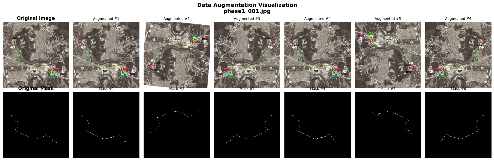

# Marathon Path Segmentation 🏃

마라톤 경로를 자동으로 분할(segmentation)하는 딥러닝 프로젝트입니다.
다양한 분할 모델, 손실 함수, 데이터 증강 기법을 지원하며, config 기반 실험 관리를 제공합니다.

## 📋 프로젝트 구조

```
marathon-path-seg/
├── configs/                    # 학습/예측 설정 파일
│   ├── unet.yaml              # U-Net 기본 설정
│   ├── unet_bce_iou.yaml       # U-Net + BCE+IoU 손실
│   ├── unet_bce_dice.yaml      # U-Net + BCE+Dice 손실
│   ├── deeplabv3.yaml          # DeepLabV3 설정
│   ├── predict_unet.yaml       # U-Net 예측 설정
│   └── predict_deeplabv3.yaml  # DeepLabV3 예측 설정
├── data/
│   ├── train/                  # 학습 데이터
│   │   ├── images/             # 학습 이미지
│   │   └── masks/              # 마스크 (바이너리)
│   └── test/                   # 테스트 데이터
│       └── images/
├── outputs/                    # 학습된 모델 저장 경로
│   ├── unet_trained/
│   ├── deeplabv3_trained/
│   └── segformer_trained/
├── experiments/                # 실험별 예측 결과
├── src/
│   ├── train.py               # 학습 스크립트 (메인)
│   ├── predict.py             # 예측 스크립트
│   ├── visualize_augmentation.py  # 데이터 증강 시각화
│   ├── models/
│   │   ├── __init__.py
│   │   ├── unet.py            # U-Net 모델
│   │   ├── deeplabv3.py       # DeepLabV3 모델
│   │   ├── resunet.py         # ResUNet (미구현)
│   │   └── segformer.py       # SegFormer (미구현)
│   ├── data/
│   │   ├── __init__.py
│   │   ├── dataset.py         # 데이터셋 클래스
│   │   └── augmentation.py    # 데이터 증강 함수
│   ├── losses/
│   │   ├── __init__.py
│   │   ├── bce.py             # Binary Cross-Entropy
│   │   ├── iou.py             # IoU Loss
│   │   └── dice.py            # Dice Loss
│   └── core/
│       ├── __init__.py
│       ├── engine.py          # 학습/검증 루프
│       ├── metrics.py         # 평가 지표
│       └── utils.py           # 유틸리티 함수
├── requirements.txt
└── README.md
```

## 🤖 지원하는 모델

| 모델 | 상태 | 백본 | 설명 |
|------|------|------|------|
| **U-Net** | ✅ 완료 | Custom | 고전적 인코더-디코더 아키텍처 |
| **DeepLabV3** | ✅ 완료 | ResNet-50 | Atrous spatial pyramid pooling 사용 |
| **ResUNet** | ❌ 미구현 | - | Residual U-Net |
| **SegFormer** | ❌ 미구현 | - | Vision Transformer 기반 |

## 📦 설치

### 1. 요구사항
- Python 3.8+
- GPU (CUDA) 권장, CPU로도 가능

### 2. 패키지 설치

```bash
pip install -r requirements.txt
```

**requirements.txt 내용:**
```
torch>=2.0.0
torchvision>=0.15.0
numpy>=1.24.0
Pillow>=9.5.0
PyYAML>=6.0
matplotlib>=3.5.0
```

## 📊 데이터 형식

### 디렉토리 구조

```
data/train/
├── images/          # RGB 이미지
│   ├── phase1_001.jpg
│   ├── phase1_002.jpg
│   └── ...
└── masks/           # 바이너리 마스크 (그레이스케일)
    ├── phase1_001.jpg
    ├── phase1_002.jpg
    └── ...
```

### 요구사항

- **이미지와 마스크의 파일명이 동일**해야 자동으로 매칭됩니다
  - 예: `images/phase1_001.jpg` ↔ `masks/phase1_001.jpg`
- **마스크는 바이너리**여야 합니다 (0=배경, 255=경로)
- 지원 포맷: `.jpg`, `.jpeg`, `.png`, `.bmp`

## 🚀 사용 방법

### 1️⃣ 데이터 증강 미리보기

증강이 실제로 어떻게 작동하는지 시각화:

```bash
python src/visualize_augmentation.py
```

출력: `augmentation_visualization.png` (원본 + 증강된 6버전 비교)

### 2️⃣ 모델 학습

#### 기본 학습 (config 사용)

```bash
python src/train.py --config configs/unet_bce_iou.yaml
```

#### CLI 옵션으로 일부 파라미터 덮어쓰기

```bash
python src/train.py \
  --config configs/deeplabv3.yaml \
  --epochs 50 \
  --lr 0.0003 \
  --batch-size 8 \
  --use-augmentation
```

#### 주요 옵션

| 옵션 | 기본값 | 설명 |
|------|--------|------|
| `--config` | - | YAML 설정 파일 경로 (필수) |
| `--epochs` | 30 | 학습 반복 횟수 |
| `--batch-size` | 4 | 배치 크기 |
| `--lr` | 0.001 | 학습률 |
| `--image-size` | 256 | 입력 이미지 크기 |
| `--use-augmentation` | False | 데이터 증강 활성화 |
| `--model-name` | unet | 모델 선택: `unet`, `deeplabv3` |
| `--loss-type` | bce_iou | 손실 함수: `bce_iou`, `bce_dice` |
| `--pos-weight` | 10.0 | 양성 클래스 가중치 (클래스 불균형 해결) |
| `--output-dir` | outputs/unet_trained | 모델 저장 경로 |

### 3️⃣ 학습된 모델로 예측

```bash
python src/predict.py \
  --config configs/predict_deeplabv3.yaml \
  --model-path outputs/deeplabv3_trained/model_final.pt
```

### 4️⃣ 학습 로그 확인

학습 후 자동으로 저장되는 로그:

```
outputs/[model_name]/
├── model_epoch_001.pt       # 각 epoch 체크포인트
├── model_epoch_002.pt
├── ...
├── model_final.pt           # 최종 모델
└── training_log.json        # 손실/평가 지표 기록
```

## ⚙️ 설정 파일 (YAML) 예시

### `configs/deeplabv3.yaml`

```yaml
# 모델
model_name: "deeplabv3"
base_channels: 32

# 데이터
data_root: "data/train"
image_size: 512
val_ratio: 0.2
use_augmentation: true        # 증강 활성화

# 학습
batch_size: 4
epochs: 30
lr: 0.0005
seed: 42
num_workers: 0

# 손실 함수
loss_type: "bce_iou"
bce_weight: 0.3
iou_weight: 0.7
pos_weight: 30.0

# 출력
output_dir: "outputs/deeplabv3_trained"
save_interval: 1
```

## 🔄 데이터 증강

현재 구현된 증강 기법 (학습 시에만 적용):

| 증강 | 확률 | 설명 |
|------|------|------|
| **Horizontal Flip** | 50% | 좌우 뒤집기 |
| **Vertical Flip** | 20% | 상하 뒤집기 |
| **Rotation** | 30% | ±10도 회전 |

**중요**: 이미지와 마스크에 동일한 변환이 적용되어 라벨이 깨지지 않습니다!

## 📈 손실 함수 조합

### BCE + IoU

```yaml
loss_type: "bce_iou"
bce_weight: 0.5
iou_weight: 0.5
```

- BCE: 픽셀 단위 분류 손실
- IoU: 영역 단위 겹침 손실
- 안정적이고 빠른 수렴

### BCE + Dice

```yaml
loss_type: "bce_dice"
bce_weight: 0.5
dice_weight: 0.5
```

- Dice: 클래스 불균형에 강함
- 경계 감지에 더 강할 수 있음

## 💡 실험 팁

### Tip 1: 클래스 불균형 처리

경로가 이미지의 작은 부분만 차지할 경우:

```bash
python src/train.py --config configs/unet.yaml --pos-weight 30.0
```

매개변수를 높일수록 양성(경로) 클래스에 더 많은 가중치를 줍니다.

### Tip 2: 데이터 증강으로 과적합 방지

```bash
python src/train.py --config configs/unet.yaml --use-augmentation
```

- 배치 크기가 작을 때 (≤ 4) 특히 효과적
- 데이터가 많지 않을 때 필수

### Tip 3: 이미지 크기 최적화

```bash
# 메모리 부족 시
python src/train.py --config configs/deeplabv3.yaml --image-size 256 --batch-size 8

# GPU 메모리 충분 시
python src/train.py --config configs/deeplabv3.yaml --image-size 512 --batch-size 4
```

## 🔧 설정 우선순위

1. **코드 기본값** (가장 낮음)
2. **YAML 설정 파일**
3. **CLI 옵션인자** (가장 높음 - 덮어씀)

이를 통해 유연한 실험 관리가 가능합니다:

```bash
# deeplabv3.yaml의 설정을 기반으로
# epochs만 50으로, augmentation만 활성화
python src/train.py --config configs/deeplabv3.yaml --epochs 50 --use-augmentation
```

### 3) 추론: config 파일 사용

```bash
python src/predict.py --config configs/predict_unet.yaml
```

### 4) 추론: config + 일부 옵션 덮어쓰기

```bash
python src/predict.py --config configs/predict_deeplabv3.yaml --threshold 0.6
```

## 주요 옵션

### train.py

- config: YAML 경로
- model-name: unet, deeplabv3, resunet, segformer
- data-root: 학습 데이터 루트
- image-size: 입력 해상도
- loss-type: bce_iou 또는 bce_dice
- bce-weight, iou-weight, dice-weight, pos-weight: 손실 가중치
- output-dir: 체크포인트/로그 저장 위치

### predict.py

- config: YAML 경로
- model-path: 체크포인트 경로
- image-dir: 추론할 이미지 폴더
- output-dir: 마스크 저장 폴더
- image-size: 입력 해상도
- threshold: 이진 마스크 기준값

## 모델별 전처리

전처리 로직은 src/data/dataset.py에 모아두었습니다.

- 공통: RGB 변환, resize, [0, 1] 스케일
- deeplabv3: ImageNet mean/std 정규화 추가
- unet: [0, 1] 스케일 기본 전처리

학습과 추론 모두 동일한 모델별 전처리 함수를 사용합니다.

## 모델 출력 형식

모든 모델은 아래 출력 형식을 반드시 맞춰야 합니다.

- 출력 텐서 형태: (B, 1, H, W)
- 값 의미: sigmoid를 통과하기 전 raw logits
- H, W: 입력 이미지 해상도와 동일해야 함

현재 코드에서 이 형식을 기준으로 동작하는 이유는 다음과 같습니다.

- 학습: BCE/IoU/Dice 손실 계산이 logits 기반으로 구현되어 있음
- 추론: predict.py에서 logits에 sigmoid를 적용한 뒤 threshold로 이진 마스크 생성

모델별 동작 예시:

- U-Net: 기본적으로 입력과 동일 해상도 logits 출력
- DeepLabV3: 내부 stride로 출력 해상도가 달라질 수 있어, 모델 내부에서 입력 해상도로 interpolate 후 반환

최종 저장 마스크 형식:

- 파일 형식: png
- 픽셀 값: 0 또는 255 (uint8)
- 저장 해상도: 원본 테스트 이미지와 동일

## 로그와 산출물

학습 시:

- output-dir/model_epoch_XXX.pt
- output-dir/model_final.pt
- output-dir/training_log.json

추론 시:

- output-dir/*_mask.png
- output-dir/prediction_log.json

예측 마스크는 원본 테스트 이미지 해상도로 저장됩니다.

## config 파일 구성 예시

학습 config 예시:

```yaml
model_name: "unet"
data_root: "data/train"
image_size: 512
loss_type: "bce_iou"
bce_weight: 0.3
iou_weight: 0.7
pos_weight: 10.0
epochs: 30
output_dir: "outputs/unet_trained/bce_iou_512_30"
```

추론 config 예시:

```yaml
model_path: "outputs/unet_trained/model_final.pt"
image_dir: "data/test/images"
output_dir: "outputs/predictions/unet"
image_size: 512
threshold: 0.5
```

## 참고

- 한 모델에 대해 loss 조합별 preset을 분리해 두면 실험 재현과 비교가 쉬워집니다.
- 단일 config로 운영하고 싶다면 unet.yaml 하나만 유지해도 됩니다.

## Data augmentation
