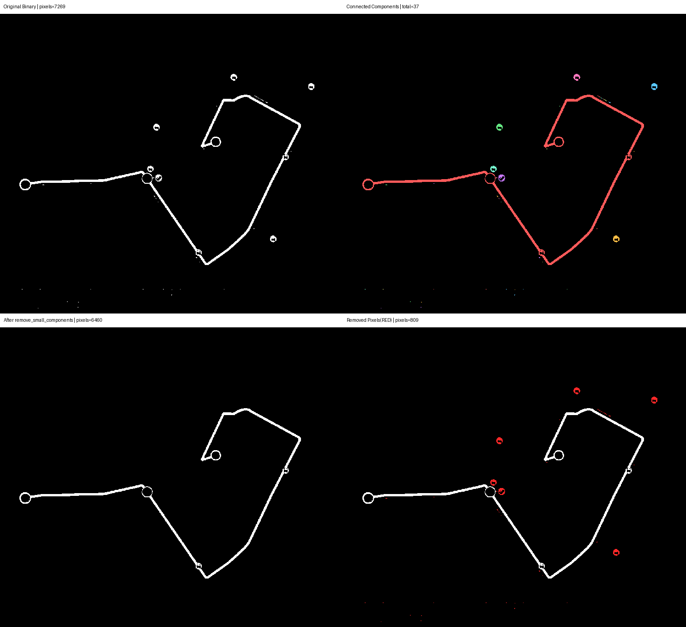
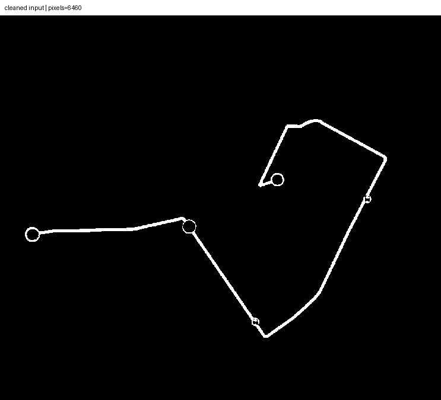
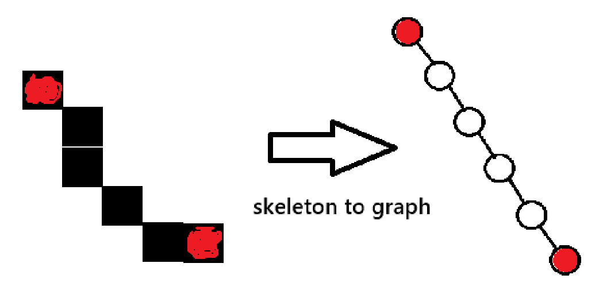

# Extracting Path Pixels from Mask Images
마라톤 마스킹 이미지에서 경로를 픽셀 좌표 리스트로 변환하려면, 단순히 흰색 픽셀을 모으는 것만으로는 부족하다. 모델이 출력한 마스크는 경로 폭이 두껍고, 작은 잡음 성분이 섞여 있으며, 픽셀 순서 정보가 없다. 이런 상태에서 좌표를 그대로 사용하면 실제 경로 중심선과의 오차가 커지고, 경로를 따라 이동하는 순서도 깨진다.

따라서 이 문서에서는 다음 목표를 가진 파이프라인을 다룬다.

1. 경로 폭을 1px 중심선에 가깝게 줄인다.
2. 잡음 성분을 제거한다.
3. 순서가 있는 경로 좌표를 만든다.
4. 최종 출력 좌표를 `(x, y)` 형식으로 고정한다.

## 좌표 체계 먼저 정리한다.

구현 내부에서는 배열 인덱싱을 사용하므로 좌표를 `(y, x)`로 다룬다. 그러나 외부로 내보내는 좌표 리스트는 지도 좌표 해석과 시각화 도구 사용 편의를 위해 `(x, y)`로 변환해 저장한다.

즉, 내부 처리 좌표와 최종 출력 좌표의 순서를 의도적으로 분리한다.

## 알고리즘의 전체 순서

알고리즘의 순서는 다음과 같다.
1. 마스크 이미지를 이진 배열로 읽는다.
2. 작은 성분을 제거한다.
3. Zhang-Suen thinning으로 skeleton을 만든다.
4. skeleton을 그래프로 변환한다.
5. 그래프에서 가장 긴 경로를 찾는다.
6. 가장 긴 경로의 좌표를 (y, x) 리스트로 반환한다.
7. (y, x) 좌표를 (x, y)로 바꿔서 반환한다.

## 마스크 이미지를 이진 배열로 읽는다.
PIL로 마스크를 열고 grayscale로 변환한 뒤, numpy 배열로 바꾼다. threshold를 적용하여 foreground 픽셀을 True로 만든다. 전체 이미지 배열에서 threshold보다 큰 픽셀을 foreground로 간주한다.

이 단계의 핵심은 정보 압축이다. grayscale 강도 정보를 경로 여부(참/거짓)로 축약하므로, threshold 값이 너무 낮으면 배경 노이즈가 유입되고, 너무 높으면 경로의 약한 구간이 끊어진다. 따라서 threshold는 이후 단계 품질을 결정하는 1차 게이트다.

```python
def load_binary_mask(mask_path: Path, threshold: int) -> np.ndarray:
    """마스크 이미지를 foreground=True인 이진 배열로 읽는다."""
    # PIL로 마스크를 열고, grayscale로 변환한 후, numpy 배열로 바꾼다.
    mask = Image.open(mask_path).convert("L")
    mask_arr = np.asarray(mask, dtype=np.uint8)

    # threshold를 적용하여 foreground 픽셀을 True로 만든다.
    # 전체 이미지 배열에서 threshold보다 큰 픽셀을 foreground로 간주한다.
    return mask_arr > threshold
```

## 작은 성분을 제거한다.
8-연결 성분(상하좌우+대각선)을 기준으로 foreground를 여러 그룹으로 분해한다. 각 그룹의 픽셀 수를 계산해 `min_area`보다 작은 그룹을 제거한다. 이 단계의 목적은 경로와 무관한 점 노이즈, 작은 섬 모양 오탐 성분을 thinning 이전에 제거하는 것이다.

왜 thinning 전에 이 작업을 수행해야 하는가.

1. 잡음 성분이 남아 있으면 skeleton에도 작은 가지가 생긴다.
2. 그래프 경로 복원 시 잘못된 endpoint가 추가된다.
3. 결과 좌표 리스트가 불안정해지고 경로 순서가 흔들린다.

아래 이미지는 `min_area=130` 기준의 제거 전/후 및 제거 픽셀 강조 결과를 보여준다.



## Zhang-Suen thinning으로 skeleton을 만든다.
skeleton은 경로의 중심선을 나타내는 1px 폭에 가까운 표현이다. Zhang-Suen 알고리즘은 위상(topology)을 최대한 유지하면서 경계 픽셀을 반복 제거해 중심선을 남긴다.

픽셀 제거 조건:
1. 픽셀의 8-이웃 중 foreground 픽셀의 개수가 2 이상 6 이하이어야 한다.
2. 픽셀의 8-이웃에서 0에서 1로 바뀌는 경우의 수가 정확히 1이어야 한다.
3. step 0에서는 p2, p4, p6 중 하나 이상이 background여야 하고, p4, p6, p8 중 하나 이상이 background여야 한다.
4. step 1에서는 p2, p4, p8 중 하나 이상이 background여야 하고, p2, p6, p8 중 하나 이상이 background여야 한다.

위 조건을 만족하는 픽셀을 제거한다. step 0과 step 1을 번갈아 반복하며, 더 이상 제거할 픽셀이 없을 때까지 진행한다.

이론적으로 보면, 조건 1과 2는 연결 구조 보존에 관여하고, 조건 3과 4는 특정 방향으로의 과도한 수축을 방지한다. 두 step을 교대로 적용하는 이유는 편향을 줄이기 위함이다.




## skeleton을 그래프로 변환한다.
skeleton에서 foreground 픽셀을 찾아 각 픽셀을 노드로 만들고, 8-이웃 연결을 간선으로 둔 그래프를 만든다. 그래프는 딕셔너리 형태로 표현하며, 키는 `(y, x)`, 값은 인접 노드 리스트다.

그래프 표현을 쓰는 이유는 순서 복원 때문이다. 픽셀 집합만으로는 경로 순서를 정의하기 어렵지만, 그래프에서는 endpoint(차수 1 노드), branch point(차수 3 이상 노드), 연결 거리 계산을 통해 경로를 안정적으로 복원할 수 있다.

## 그래프에서 가장 긴 경로를 찾는다.
그래프에서 가장 긴 경로를 찾는다. 일반적으로 다음 전략을 사용한다.

1. endpoint가 충분하면 endpoint 후보들 사이의 경로 길이를 비교한다.
2. 가장 긴 연결 시퀀스를 주 경로로 선택한다.
3. endpoint가 없는 루프 구조면 지름(diameter) 근사 경로를 선택한다.

이 단계의 목적은 분기나 잔가지가 있어도 실제 주행 경로에 해당하는 주 라인을 선택하는 것이다.



## 가장 긴 경로의 좌표를 (y, x) 리스트로 반환한다.
가장 긴 경로를 `(y, x)` 좌표 리스트로 반환한다. 이 순서는 numpy 인덱싱과 동일하므로 내부 계산에서 가장 일관적이다.

순서 안정성을 높이기 위해 시작점 선택 규칙(예: 더 위쪽/왼쪽 endpoint 우선)을 고정하면 같은 입력에 대해 동일한 순서의 경로 리스트를 얻을 수 있다.

## (y, x) 좌표를 (x, y)로 바꿔서 반환한다.
가장 긴 경로의 좌표 리스트에서 각 좌표를 `(y, x)`에서 `(x, y)`로 바꿔서 반환한다. 외부 시스템(시각화, 지도 좌표 변환, API 전달)에서는 `(x, y)`가 더 직관적이고 일반적이기 때문이다.

```json
{
  "input_mask": "experiments\\exp07_unet_1024\\049_mask.png",
  "image_width": 720,
  "image_height": 419,
  "coordinate_format": "(x, y)",
  "ordered_pixels_xy": [
    [
      154,
      387
    ],
    [
      154,
      388
    ],

    ...,

    [
      337,
      685
    ]
  ],
  "num_pixels": 305
}
```

## 최종 산출물 형태를 명시한다.

최종 결과는 아래 정보가 포함된 구조를 권장한다.

1. 입력 마스크 경로
2. 이미지 해상도
3. 좌표 포맷 문자열 `(x, y)`
4. 순서가 있는 픽셀 리스트
5. 총 픽셀 개수

이 구조를 고정하면 후속 단계(지도 매핑, 선분 단순화, 거리 계산)에서 파싱 규칙이 단순해진다.

## 품질 점검 체크리스트

좌표 리스트를 사용하기 전에 아래를 점검한다.

1. 작은 성분 제거 후 주 경로가 끊기지 않았는가.
2. thinning 결과가 과도하게 붕괴되지 않았는가.
3. 추출된 리스트가 실제 경로 방향으로 연속적으로 증가하는가.
4. 출력 좌표가 `(x, y)` 순서로 저장되었는가.

## 파라미터 튜닝 기준

1. 노이즈가 많으면 `min_area`를 올린다.
2. 경로가 자주 끊기면 `min_area`를 낮춘다.
3. 경계가 흐린 마스크면 `threshold`를 낮춘다.
4. 배경 오탐이 많으면 `threshold`를 높인다.

이상과 같이, 이 파이프라인은 마스크를 단순한 면적 정보에서 순서 있는 중심선 좌표 정보로 바꾸는 과정이다.

